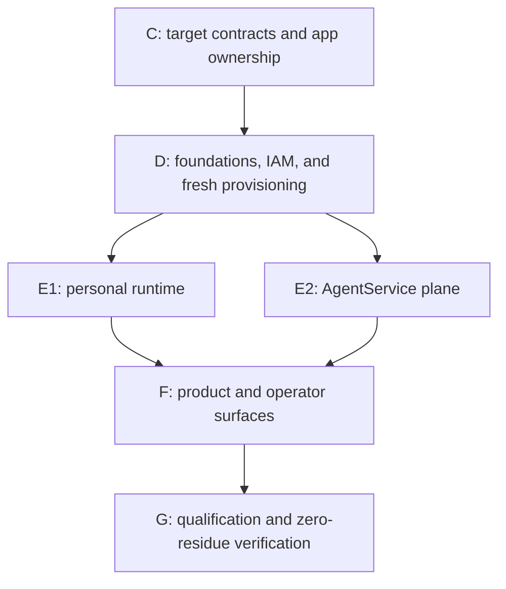

# Personal-agent platform direct refactor plan

Status: **adopted — 2026-07-18.** OpenCrane is still building a new product.
Existing OpenCrane systems and their data will be deleted, not operated as a migration source or
preserved as a predecessor product.

The target is the
[personal-agent platform architecture](personal-agent-platform-architecture.md), with the bounded
runtime/toolkit decision supplied by the
[OpenClaw loop investigation](openclaw-agent-loop-replacement-plan.md). Former transition designs
are obsolete; version control retains their history without keeping them in the executable
documentation set.

The active sequencing index is [`plan.md`](../../plan.md). Implementation works from its linked
issues and lands as small reviewed PRs on `own-personal-ai-agent-setup`.

## Executive conclusion

Refactor the repository directly into the target product:

1. retain only foundations whose contracts fit the target;
2. define target schemas, APIs, identity boundaries, application ownership, and independent tests;
3. implement fresh target stores, credentials, controllers, runtime, AgentService, and UI;
4. delete each replaced legacy path in the same slice;
5. qualify the complete product from a fresh environment;
6. remove the remaining OpenClaw and obsolete infrastructure residue.

There is no production transition program. Build the target authorities, stores, protocols, and
deployables directly; delete every replaced predecessor path. Existing OpenCrane state is neither
preserved nor transformed. The absence of backward compatibility is a deletion rule, not a reason
to build machinery around dead systems.

## Product and architecture contract

OpenCrane owns the durable product shell:

- Thread, Message, Run, RunEvent, Approval, and transcript authority;
- retries, cancellation, compaction, budgets, idempotency, and external-action evidence;
- required onboarding interview, versioned question set, `SOUL.md` template selection, user-approved
  first PersonaRevision, and explicit preference learning/correction/forgetting;
- AgentService, immutable AgentRevision, schedules, sharing, and effective access;
- artifact, skill, memory, and audit authorities;
- identity, authorization, proof-bound capabilities, and tool policy.

A conformance-selected TypeScript toolkit owns only the bounded model/tool loop. The primary spike
is `@openai/agents`; `ai`/`ToolLoopAgent` is the control. Python is allowed only in isolated,
governed tool/authoring Jobs.

Projects remain a scope dimension separate from departments and teams. A project may grant access
to people from multiple departments without changing their organizational membership.

## Keep and reuse when target-shaped

- ClusterTenant isolation as the deployment boundary;
- fleet lifecycle and membership APIs that express current target authority;
- Zitadel OIDC and verified subject binding;
- Postgres/CNPG, LiteLLM, Obot, Cognee, and OpenTelemetry;
- generic Kubernetes quota, storage, ingress, deployment, and workload utilities;
- same-origin organization routing;
- runtime-neutral frontend gateway concepts, rewritten around the canonical protocol;
- test, release, Helm, observability, and workspace tooling without legacy-domain dependencies.

Reuse is earned by the current contract. A legacy name, schema, identifier, adapter, or compatibility
requirement is not preserved merely because its implementation already exists.

## Build as the target product

- per-silo OpenCrane product authority and authorization facade;
- proof-bound workload, run, and action capabilities;
- AgentService, AgentRevision, AgentRun, Thread, Message, RunEvent, Approval, Persona, Artifact,
  SkillRevision, audit, and membership-projection models;
- channel proxy and agent controller as separate trust-boundary apps;
- filesystem-backed content-addressed ArtifactStore and Cognee event pipeline;
- TypeScript runtime selected by the conformance gate;
- personal agent pods, first-party managed agents, and user-created managed agents;
- deterministic fresh provisioning, backup/restore, and deletion;
- indefinitely retained canonical target data on explicitly mounted, online-expandable volumes;
- mounted non-authoritative runtime scratch with no long-term per-agent tenant storage;
- one OpenCrane API/UI for all user and operator product behavior.

## Delete instead of porting

- OpenClaw runtime, configuration, protocol, plugin, gateway, and workspace compatibility;
- OpenClaw JSONL as transcript authority;
- Tenant and AccessPolicy CRDs as business authorities;
- `/auth/pod-token`, pairing, BrokeredDevice, gateway-admin state, and static internal agent tokens;
- mutable workspace persona files and `SessionScope` product state;
- awareness/participation rollout models and the legacy ingestion interval loop (its useful behaviour returns as a central agent driven by an Obot MCP server);
- `feat-skill-registry`, Zot/core OCI, shared skill files/PVC, and DB/OCI fallbacks;
- broad secret broadcasts and arbitrary config overrides;
- Linkerd and obsolete shared/multi-instance/billing topology switches;
- compatibility schemas, aliases, migrations, dual writes, legacy test fixtures, and reverse bridges.

CI must reject forbidden legacy imports and configuration from the first target-state implementation
PR. The reaper gate removes superseded exports, contracts, routes, tests, deployment wiring, and docs
before each slice finishes.

## Application ownership

Every workload that becomes a Pod or Job has exactly one `apps/<name>` owner or deployment-only
`apps/_infra/<name>` owner. Apps are lightweight deployment rollups; reusable behaviour belongs in
functional `libs/*` packages. Runtime instances are workloads of their app, not newly invented
deployables.

| Workload class | Owning app |
|---|---|
| Control-plane API and UI | `apps/opencrane`, `apps/opencrane-ui` |
| Channel trust boundary | `apps/channel-proxy` |
| Kubernetes mutation boundary | `apps/agent-controller` |
| Artifact bytes and CAS API | `apps/artifact-service` |
| Cognee, LiteLLM, Obot | `apps/_infra/cognee`, `apps/_infra/litellm`, `apps/_infra/obot` |
| Memory gateway and Cognee indexer | `apps/memory-gateway`, `apps/cognee-indexer` |
| Personal agent pods | `apps/agent-runtime` |
| OpenCrane Postgres cluster | `apps/postgres` over a BYO CNPG operator |
| First-party and user-created managed-agent pods | `apps/managed-agent-runtime`; individual agents are AgentService records, not app roots |
| Skill authoring, sandboxed tool, and fresh provisioning Jobs | `apps/skill-authoring`, `apps/tool-runner`, and `apps/silo-provisioner` respectively |

Ingress, DNS, certificate, CNI, and CNPG controllers are cluster prerequisites, not product-release
workloads. Existing installer-script ownership and its transient database-auth Pod are deleted as
the app-owned and BYO target topology lands.

## Identity and authorization invariants

- Postgres/OpenCrane authorities decide product access; Kubernetes RBAC does not.
- Runtime Pods and Jobs have no Kubernetes mutation permissions.
- `apps/agent-controller` is the sole OpenCrane agent-workload Kubernetes mutator.
- Every app maps explicitly to KSA, projected token audience, Kubernetes/cloud role, namespace, and
  network profile. Default service-account token automount is disabled.
- Cloud KSA trust bindings are Terraform-owned.
- Cilium/default-deny policies and live allow/deny probes are mandatory for every runtime profile.
- Capability validation binds CT, subject, KSA, Pod/Job UID, run, revision, proof, action, arguments,
  expiry, and replay state as applicable.
- Personal→managed sharing is one way: managed agents receive declared inputs/shared artifacts but
  cannot inspect personal workspaces, threads, memory, configuration, filesystems, or logs.
- Provider and integration credentials are issued or authorized fresh through target custody.

Wrong tenant, subject, workload identity, proof, arguments, or replay must fail closed.

## Delivery map

The runtime and AgentService lanes can proceed concurrently after their shared contracts and
foundations land. All other phases are sequential gates.

## Phase C — target contracts and app ownership

Deliver:

- the capability catalog and named critical user/operator journeys;
- canonical runtime, transcript, artifact, skill, memory, identity, and authorization contracts;
- grant deny/priority semantics and organization/department/team/project/personal/user scopes;
- target Postgres model boundaries and API ownership;
- membership freshness and fail-closed behavior;
- app→library dependency rules and the complete app→KSA→role→network matrix;
- independently authored acceptance fixtures based on target product intent;
- ADRs superseding transition-era delivery decisions.

Exit: schemas, APIs, policies, and tests can be implemented without consulting legacy behavior.
Architecture and reaper gates return PASS.

## Phase D — foundations, identity, and fresh provisioning

Deliver:

- target app packages and app-owned deployment units;
- Postgres schema for AgentService/Revision/Run, transcript/events, persona, artifacts, skills,
  approvals, audit, and membership projection;
- authorization facade, proof-of-possession, action-token replay/idempotency, and effective-access
  explanations;
- channel proxy delegating session and membership decisions to OpenCrane;
- agent controller as the only agent-workload Kubernetes mutator;
- bounded workload KSAs, projected tokens, Cilium policies, Obot isolation, and zero runtime RBAC;
- ArtifactStore CAS lease/promote/finalize, digest-reference GC, outbox, snapshots, and restore;
- app-owned Cognee, LiteLLM, and Obot packaging plus adapters;
- deterministic creation of fresh Postgres, ArtifactStore, Cognee, Obot, LiteLLM, cache, telemetry,
  IAM, OIDC, credential, key, salt, and encryption-key state;
- deletion of every replaced legacy schema, authority, app, export, route, and deployment value.

Validation:

- a fresh environment can be built solely from reviewed target artifacts;
- forbidden legacy/OpenClaw imports and values fail CI;
- negative `kubectl auth can-i` tests prove non-controller workloads cannot mutate Kubernetes;
- live Cilium allow/deny probes match every runtime profile;
- wrong CT/subject/KSA/Pod UID/run/revision/proof/action/arguments/replay fails closed;
- backup/restore reconstructs authoritative state and Cognee projections;
- every durable state path is an expandable persistent-volume mount, and runtime workspaces prove
  they are mounted non-authoritative scratch with no long-term user data;
- repeat provisioning produces the same topology without relying on old databases or credentials.

## Phase E1 — personal runtime and data planes

Deliver:

- `RunInputSnapshot` and deterministic prompt compiler;
- both candidate TypeScript toolkit adapters against the same independent fixtures and target
  LiteLLM matrix;
- one exact-pinned selected driver and its reliability envelope;
- canonical Thread/Message/RunEvent protocol behind the frontend gateway;
- memory, artifact, session, approval, tracing, cancellation, retry, compaction, and budget adapters;
- required onboarding interview, versioned questions, `SOUL.md` template selection, user-approved
  first PersonaRevision, persona compilation, and transparent PreferenceFact learning/correction/
  forgetting;
- multimodal upload/preprocessing and artifact-reference inputs;
- rendered and verified document-authoring ArtifactVersions;
- scanned, signed, authorized, revocable Python skills executed in isolated Jobs;
- provider-neutral model capability/failover matrix.

There is no OpenClaw compatibility adapter, transcript mirror, workspace renderer, plugin hook, or
gateway-v4 schema.

## Phase E2 — AgentService, scopes, scheduling, and operations

Deliver:

- personal and managed AgentServices with immutable revisions and owners;
- organization, department, team, project, personal, and explicit-user sharing;
- schedules, idempotent triggers, recorded runs/outbox, suspended one-attempt Jobs, Job/Pod-bound
  bootstrap, concurrency, deadlines, backoff, cancellation, and terminal repair;
- scheduled AgentService identity independent of its creator;
- central agents: org/department/team/shared managed AgentServices, schedule- or event-triggered for
  one bounded task, on the shared personal-agent runtime substrate under a narrower connector-scoped
  identity, reaching external systems only through Obot-custodied MCP servers (multi-instance, e.g.
  one per connected source);
- the strict personal→managed boundary;
- approvals, effective access, audit, model/cost evidence, schedules, run status, and notifications;
- OpenTelemetry plus durable business/run evidence;
- runbooks for pause, revoke, provider/PEP outage, restore, and forward repair.

Central agents run on the same runtime substrate as personal agents (the suspended one-attempt Job,
controller, and outbound-only shell) but under a narrower, connector-scoped workload identity that is
independent of any human user, extending the "scheduled AgentService identity independent of its
creator" rule above. There is no bespoke per-source worker: external systems are reached only through
Obot-custodied MCP servers, which may be instantiated per connected source. The legacy ingestion
interval worker and its direct Cognee writes are deleted.

## Phase F — product and operator surfaces

Deliver one OpenCrane UI/API for:

- conversation, persona, preferences, memory, tools, model, and budget;
- agent catalog, revision diff/publish/rollback, ownership, and sharing;
- schedules, live/history runs, attempts, cancellation/retry, costs, and artifacts;
- approval inbox with exact action, arguments, diff, and expiry;
- assets, versions, previews, lineage, grants, indexing, retention, and deletion;
- skills, tests, scans, publication, and revocation;
- membership, effective-access explanation, audit, denied calls, health, index lag, and versions;
- generated automation clients for the small set of non-UI workflows that remain.

Obot, Cognee, Langfuse, and Kubernetes consoles are diagnostic, never parallel product configuration
surfaces. Delete the corresponding legacy UI/API route when its target journey passes.

## Phase G — qualification and zero-residue verification

Run the complete product from a freshly provisioned environment. Acceptance covers:

- personal voice, preferences, and memory across restart and scale-to-zero;
- transcript/history, reconnect, compaction, cancellation, and crash recovery;
- tools, approvals, replay denial, provider failover, and external-side-effect safety;
- every grant/share type and membership outage/staleness behavior;
- artifact upload/version/share/revoke/delete/index rebuild and backup/restore;
- multimodal, document, and skill authoring including malicious input/code tests;
- schedule overlap, retry, cancel, offboarding, and revocation;
- load, cost, capacity, chaos, observability, and on-call runbooks;
- all named critical product and operator journeys.

Release gates:

- zero Critical or High security findings;
- all critical capability and authorization fixtures pass;
- zero cross-tenant access or duplicate external side effects;
- target SLO, load, cost, backup/restore, and operator thresholds are recorded and pass;
- future application updates reach ready target Pods in under five minutes per silo;
- architecture, reaper, independent review, and documentation gates pass.

Verify that every owning replacement slice already deleted its OpenClaw code/config/protocol/
plugins/workspaces, legacy CRDs and schemas, projection repairers, old `feat-*` apps, Zot/Linkerd
paths, static credentials, obsolete values, images, secrets, tests, dashboards, docs, and issue
references. Any residue blocks qualification and returns to its owning phase for deletion. Add
forbidden-reference checks that prevent it from returning.

Exit: a fresh checkout contains one target architecture and one supported product path. It builds,
tests, deploys, restores, and operates without any predecessor-system assumption.

## Issue routing

| Issue | Direct-refactor disposition |
|---|---|
| [#117](https://github.com/italanta/opencrane/issues/117) | Apply enforcing CNI and identity-matrix work to target runtime profiles |
| [#127](https://github.com/italanta/opencrane/issues/127) | Retain default-deny, per-silo routing, encrypted-storage preflight, and live probes |
| [#128](https://github.com/italanta/opencrane/issues/128) | Target Obot custody, grants, and runtime-neutral MCP; delete fake success |
| [#129](https://github.com/italanta/opencrane/issues/129) | AgentService/Revision/Run/schedule epic |
| [#133](https://github.com/italanta/opencrane/issues/133) | Supersede Zot-only skills with ArtifactStore-backed SkillRevision |
| [#135](https://github.com/italanta/opencrane/issues/135) | Remove broad provider-secret broadcast with its legacy owner |
| [#150](https://github.com/italanta/opencrane/issues/150) | Keep only target fleet/silo lifecycle and OIDC contracts |
| [#154](https://github.com/italanta/opencrane/issues/154) | Replace generic plugin-kernel work with concrete app/module contracts |
| [#162](https://github.com/italanta/opencrane/issues/162) | Keep target chart-native UI deployment work |
| [#174](https://github.com/italanta/opencrane/issues/174) | Fix bounded target LiteLLM provisioning and reconcile behavior |
| [#220](https://github.com/italanta/opencrane/issues/220) | Carry least privilege into target workloads; delete OpenClaw-specific scope |
| [#221](https://github.com/italanta/opencrane/issues/221) | Generalize canonical KSA identity into the target identity matrix |
| [#222](https://github.com/italanta/opencrane/issues/222) | Artifact-backed, scanned, signed skills and isolated Python execution |
| [#224](https://github.com/italanta/opencrane/issues/224) | Target model/cost/provider/budget console |
| [#225](https://github.com/italanta/opencrane/issues/225) | Keep runtime-neutral stream/render/artifact/security work; delete gateway scope |
| [#226](https://github.com/italanta/opencrane/issues/226) | Membership management over authoritative target APIs |
| [#227](https://github.com/italanta/opencrane/issues/227) | Delete replaced packages and images as their owning slices land |
| [#231](https://github.com/italanta/opencrane/issues/231) | Introduce final names directly; no aliases or legacy DNS preservation |

## Staffing and execution

Recommended focused lanes:

- platform/data;
- runtime/product;
- frontend/console;
- shared SRE, security, and test capacity.

Do not reserve engineers for predecessor-system maintenance, migration, or transition operations.
Spend that capacity on target implementation, destructive reaper passes, independent review, and
end-to-end qualification.

## Stop rules

Block a slice when:

- it introduces a legacy schema, protocol, adapter, converter, token, endpoint, identifier, or test
  fixture into target code;
- a deployable or Job lacks one app owner and identity/network profile;
- a runtime receives Kubernetes mutation RBAC;
- authorization or tenant isolation does not fail closed;
- an external side effect lacks idempotency and durable evidence;
- target authorities cannot be reconstructed from target backups;
- the slice leaves its superseded legacy path reachable;
- Critical or High review findings remain open.

These are implementation-quality gates, not production-transition approvals.
