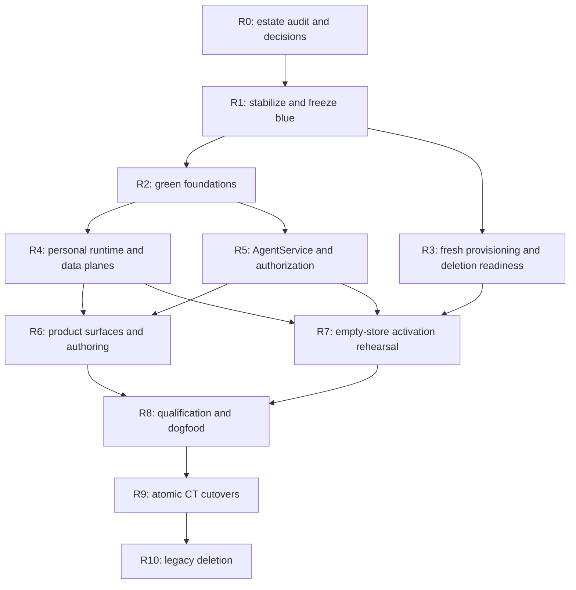

# Personal-agent platform rewrite-freeze plan

Status: **adopted — 2026-07-16.** [ADR 0006](../adr/0006-rewrite-freeze-whole-silo-cutover.md)
selects this production rewrite freeze and whole-silo blue/green replacement for the target in the
[personal-agent platform architecture](personal-agent-platform-architecture.md), instead of the
[rejected historical strangler proposal](personal-agent-platform-simplification-plan.md). That
proposal is not executable and is not a rollback or delivery escape route.
The pinned baseline and toolkit decision in the
[OpenClaw loop investigation](openclaw-agent-loop-replacement-plan.md) apply to this route too: its
L0 baseline is part of R1, and its L3–L5 bake-off/reliability gates are part of R4.

The active sequencing index is [`plan.md`](../../plan.md); implementation works from its linked
GitHub issues.

## Executive conclusion

The adopted freeze route is:

1. stabilize and tag one supportable OpenClaw-based release;
2. freeze legacy product/schema development;
3. build the final OpenCrane-owned, OpenClaw-free platform in an isolated green release with no OpenClaw
   compatibility layer or legacy-shaped inputs;
4. initialize every green store, identity, identifier, credential, configuration, artifact, and
   product record fresh, without reading, exporting, importing, copying, converting, or reconstructing
   anything from blue;
5. rehearse clean empty-store provisioning, blue-archive isolation, activation, abort, and recovery;
6. replace one complete ClusterTenant silo at a time;
7. delete the legacy platform after every silo's retention window.

This is **not** a fleet-wide big bang. A ClusterTenant is entirely blue or entirely green; it never
uses a mixture of old/new agent loop, transcript authority, artifacts, schedules, or authorization.
Cutting silos in cohorts limits blast radius without becoming a feature-by-feature strangler.

A rewrite freeze gives the implementation team a cleaner construction environment. It gives the
organization a harder cutover:

- no product value reaches production until the whole green platform is ready;
- user/runtime feedback is delayed until dogfood and cutover;
- every fresh provisioning and user onboarding dependency converges at cutover;
- rollback is safe only before green accepts writes or performs external side effects;
- blue and green infrastructure must be operated simultaneously;
- the frozen platform still needs security and availability maintenance.

The freeze is likely simpler overall when there are few live ClusterTenants, most users are internal
or pilot users, and everyone accepts a completely fresh start. Personal history, memory, artifacts,
identifiers, configuration, and credentials are not preserved; users sign in, configure, create,
and reconnect anew through green after activation.

## Decision test

The delivery strategy is fixed. These rows record why the rejected alternatives do not apply:

| Production condition | Recommended route |
|---|---|
| Users accept empty green stores and fresh onboarding | Adopted clean-build route |
| Any legacy value must enter green | Out of scope; do not add a transfer path |
| Post-write reverse rollback is requested | Out of scope; recover forward in green |
| Requirements/persona/runtime behavior are still changing rapidly | Stabilize the green contract before activation; do not revive a bridge |
| Current estate is small, internal, and can accept a multi-month product freeze | Fits the adopted route |
| Current estate cannot accept a fresh start | This program does not preserve that estate; raise a separate product decision, not a hidden transfer mechanism |

Gate R0 records the no-transfer boundary and the product/operating approvals needed to activate an
empty green silo. It does not classify data or create exceptions.

## What “rewrite” means

Rewrite the agent/control domain that is structurally coupled to OpenClaw. Reuse sound foundations
rather than recreating the entire company platform.

### Keep and reuse

- the ClusterTenant silo boundary and versioned fleet lifecycle/membership contracts;
- the OpenCrane API/UI foundations and same-origin organization routing behavior;
- OIDC identity semantics and verified subject binding;
- Postgres/CNPG, LiteLLM, Obot, Cognee, and OpenTelemetry as upstream products;
- generic Kubernetes deployment, quota, storage, ingress, and workload-building utilities;
- the runtime-neutral frontend `ConversationGateway` shape, revised around the new protocol;
- test, release, Helm, observability, and workspace tooling that has no legacy-domain dependency.

### Build clean in green

- one per-silo OpenCrane business authority and authorization facade;
- proof-bound workload/run/action capabilities;
- AgentService, AgentRevision, AgentRun, Thread, Message, RunEvent, Approval, Persona, Artifact, and
  SkillRevision models;
- channel proxy and agent controller as separate trust-boundary apps;
- filesystem-backed content-addressed artifact service and Cognee event pipeline;
- TypeScript toolkit-backed runtime selected by the linked OpenClaw loop conformance gate;
- personal assistant persona/preference/memory compiler;
- managed schedules and Kubernetes Deployments/CronJobs/Jobs;
- isolated multimodal/document/Python-skill authoring Jobs;
- one management, approval, run, asset, and operations console.

### Do not port into green

- OpenClaw runtime/config/protocol/plugin/workspace compatibility;
- Tenant and AccessPolicy CRDs as business authorities;
- `/auth/pod-token`, pairing, BrokeredDevice, and device/gateway-admin state;
- OpenClaw JSONL as the live transcript authority;
- mutable workspace persona files or `SessionScope` as product state;
- awareness rollout/participation models or the Slack-specific central-agent loop;
- `feat-skill-registry`, Zot/core OCI, shared skill files/PVC, or DB/OCI fallbacks;
- arbitrary config overrides, broad secret broadcasts, or static internal agent tokens;
- Linkerd and legacy fleet/shared/multi-instance/billing topology switches;
- a generic plugin kernel before concrete app/module contracts require one.

Green code cannot import OpenClaw or retired domain packages. CI enforces the forbidden dependency
list from the first green PR.

## Freeze contract

### Pre-freeze stabilization runway

A rewrite freeze cannot grandfather known security or production defects for five to eight months.
Complete the blockers in the live issue table before declaring the frozen release.

The freeze begins only when:

- the current system has mandatory default-deny/isolation and encrypted-storage preflights;
- provider secrets are no longer broadly broadcast, or the dependent legacy path is disabled;
- projected ServiceAccount identity parsing is canonical and repaired;
- OpenClaw has a fixed least-privilege production profile;
- LiteLLM reconcile storms/team provisioning are fixed;
- the chart-native UI and fleet/silo contract have one supportable version;
- backup, restore, OIDC login, conversation, memory, and emergency-revoke smoke tests pass;
- every MCP capability retained in the frozen catalog passes a real scoped-credential smoke test;
  an incomplete MCP path is instead removed from the catalog, disabled, and proven fail-closed;
- a slot-neutral cutover supervisor can suspend blue reconcilers, quarantine all blue execution and
  side-effect paths, prove the fence, and reactivate the exact signed frozen manifest on abort;
- every image/chart/config digest is recorded in a signed frozen-release manifest.

The known production blockers are **10–18 engineering weeks**; the neutral cutover supervisor adds
**2–4**, making the total pre-freeze runway **12–22 engineering weeks**, probably **4–7 calendar
weeks** with parallel owners. An unresolved isolation, authorization, identity, credential,
data-integrity, backup/restore, or known production-availability blocker rejects the rewrite-freeze
route. Gate R0 may accept only a non-safety capability gap that is explicitly removed or disabled in
the frozen catalog; it records an owner, expiry, and green disposition rather than waiving a
production defect.

### Changes allowed after the freeze

Only newly discovered issues in these classes may modify blue:

- active credential or data exposure;
- cross-tenant authorization or isolation failure;
- data loss or corruption;
- production outage or runaway reconcile/resource consumption;
- critical dependency/provider breakage;
- defect blocking clean provisioning, archive isolation, abort, or cutover verification.

Every exception must be minimal, backward-compatible, independently reviewed, added to the frozen
conformance suite, and accompanied by a recorded green-applicability decision. Security is never
frozen.

### Changes prohibited after the freeze

- new product behavior, channels, tools, workflows, or model features;
- new legacy database/CRD fields;
- discretionary OpenClaw/plugin upgrades or more vendored gateway/rendering surface;
- legacy refactors, renames, topology changes, CLI expansion, or plugin-framework work;
- implementing a feature in both blue and green;
- “temporary” dual writes or a compatibility adapter without changing the strategy decision.

### Branch and review mechanics

- Tag the frozen source as an immutable release, for example `openclaw-freeze-YYYYMMDD`.
- Keep `main` as the protected blue maintenance line until the final replacement.
- Create protected `feat/agent-platform-v2` as the green integration target.
- Land green through small, normal pull requests into that integration branch; never accumulate one
  unreviewed mega-commit.
- Every blue exception has a linked green applicability/cherry-pick decision.
- Build/deploy green images only from reviewed commits and signed immutable digests.
- The final mainline replacement PR is large mechanically, but every constituent capability has
  already passed review, CI, and acceptance on the protected green branch.

Reserve **0.5–1 engineer** for blue maintenance and cutover support. Do not count that person as
full-time green delivery capacity.

## Isolated green topology

Build the final application paths directly on the green branch:

```text
apps/
  opencrane/
  opencrane-ui/
  channel-proxy/
  agent-controller/
  agent-runtime/
  artifact-service/
  cognee/
  obot/
  opencrane-infra/
```

Green uses separate namespaces/releases, Postgres databases, PVCs, secrets, KSAs, Obot/Cognee
instances, LiteLLM keys/teams, and telemetry labels. It receives no live organization ingress and
cannot run schedules, external tools, email/chat actions, or production provider calls until its
cutover gate.

The fleet lifecycle authority owns `(activeSlot, blueFenceState, activationEpoch, activationPhase,
deploymentGeneration)` in the ClusterTenant deployment contract. `activationPhase` advances through
an explicit state machine such as `quarantined → read-only → writes → models → tools →
schedules`; it never skips a phase. One slot-neutral per-silo operator is the only reconciler allowed
to apply that desired state to ingress, DNS, certificates, workload quarantine, and execution gates;
blue and green releases cannot mutate the public edge directly. The named cutover authority changes
the state with compare-and-swap against the expected generation, activation epoch, fleet membership
revision, verified blue fence, and a live per-CT cutover lease.

Green ingress, mutation APIs, artifact finalizers, schedulers, Jobs, capability issuance, model/Obot
PEPs, and notifications must carry or resolve the active slot/epoch and reject an inactive or stale
one. Frozen blue is not assumed to understand the new epoch. Before route handoff, the neutral
operator suspends blue reconcilers, scales every execution/scheduler/notification component to zero,
removes mutating endpoints, applies a cutover network fence denying model/Obot/provider/message
egress, and reports `blueFenceState=quarantined` only after live probes prove the fence. The slot CAS
cannot proceed without that status.

Each transition increments the generation; switching slots also increments the activation epoch so
legacy tokens are rejected by green validators while blue remains physically quarantined. A crashed
or retried runbook therefore leaves one recorded fail-closed phase rather than a partially activated
collection of components.

Before handoff, green uses an internal test host and its public-edge and side-effect controllers are
disabled. The runbook invokes the authoritative compare-and-swap; it is not itself the authority and
`activeSlot` is not a product feature flag.

The active-slot control is cutover infrastructure. Remove it after all ClusterTenants and rollback
windows have completed.

## Delivery map



R2/R3 and R4/R5 run concurrently. No green capability serves a live blue ClusterTenant before R9.

## R0 — clean-build boundary and irreversible decisions

Expected effort: **2–3 engineering weeks.**

Decide:

- exact scope/persona/runtime capability baseline—new feature requests wait until after launch;
- grant deny/priority semantics and project-scope handling;
- fleet-managed membership freshness/failure policy;
- fresh persona, agent, integration, skill, document, and user-onboarding behavior;
- green-only transcript, tool-output, audit, artifact, and retention rules;
- fresh green credential issuance plus blue revocation/deletion;
- fleet lifecycle/membership cutover lease, revision, and queued-mutation contract;
- maximum per-silo maintenance window;
- cutover cohort/order and who may sign the commit point;
- minimum SLO, load, security, disaster-recovery, and operator acceptance evidence.

The legacy-state decision is singular: exclude it from green. No dataset, file, byte, record,
identifier, identity, configuration, credential, schema, protocol, or derived value has an exception.
Blue may be retained as an isolated read-only archive until its approved deletion trigger, but no
green component or provisioning tool may read it.

Exit gate: target architecture ADRs, frozen product contract, no-transfer cutover/rollback policy,
owners, budget, and schedule are approved. Post-commit recovery is forward in green.

## R1 — stabilize, snapshot, and freeze blue

Expected effort: the **12–22 engineering-week pre-freeze runway** above, followed by **1–2 weeks** to
record the baseline.

Deliver:

- execute Gate L0 from the linked loop plan against the exact frozen artifact, limited to the
  immutable-image cold-start, support, quarantine, and deletion baseline;
- finish the pre-freeze issue set and close/split the legacy portions;
- install and rehearse the slot-neutral blue quarantine/reactivation supervisor against the exact
  frozen workload manifest; this cutover prerequisite is complete before source freeze;
- tag, sign, and publish the frozen source/image/chart/config manifest;
- inventory OpenAPI, DB schemas, CRDs, effective-contract format, Helm renders, gateway behavior,
  and generated clients only to support, fence, and delete blue; none is a green input;
- record current SLOs, resource/cost baselines, tenant counts, data volumes, state-volume layouts,
  Cognee datasets, Obot/LiteLLM versions, and credential types;
- author green conversation, memory, MCP, authorization, persona, artifact, schedule, and failure
  fixtures independently from the approved R0 product contract, without observing or deriving them
  from blue behavior, frames, data, schemas, protocols, identifiers, or decisions;
- create a blue maintenance matrix and escalation/on-call owner;
- lower DNS TTLs only when entering a scheduled cutover window, not for the whole program.

Exit gate: blue can be supported, fenced, restored before commit, and deleted without feature
development. Green's only versioned source contract is the independently approved R0 product
contract; blue behavior and artifacts are not conformance inputs.

## R2 — build clean green foundations

Expected effort: **7–11 engineering weeks.**

Deliver:

- target app packages and app-owned deployment units;
- Postgres schema for AgentService/Revision/Run, transcript/events, persona, artifacts, skills,
  approvals, audit, and membership projection;
- OpenCrane authorization facade, capability classes, proof-of-possession, controller-bound Pod/Job
  assignment, action-token replay/idempotency, and effective-access explanations;
- channel proxy delegating OIDC/session/membership decisions to OpenCrane;
- versioned fleet-membership projection plus a per-CT cutover lease that fences or queues upstream
  lifecycle/membership mutations at a captured source revision;
- agent controller as the only OpenCrane agent-workload K8s mutator;
- bounded workload-profile KSAs, projected tokens, Cilium/default-deny policies, Obot controller
  isolation, and zero K8s RBAC for runtimes;
- an explicit app→KSA→Kubernetes/cloud-role→network identity matrix; default token automount is
  disabled, new cloud KSA trust bindings are Terraform-owned, and only narrowly scoped projected
  audience tokens are mounted where required;
- artifact CAS lease/promote/finalize protocol, digest-reference GC, outbox, snapshots, and restore;
- app-owned Cognee and Obot packaging plus adapters;
- active-slot/quarantine controls that cannot accidentally own public ingress or side effects.

Validation:

- no green dependency imports a forbidden legacy/OpenClaw package;
- wrong CT/subject/KSA/Pod UID/run/revision/proof/action/arguments/replay fails closed;
- negative `kubectl auth can-i` coverage proves every non-controller app and runtime lacks K8s
  mutation rights; controller verbs, Obot namespace/admission confinement, and cloud KSA bindings
  exactly match the identity matrix;
- Cilium agent/operator readiness and policy endpoint enforcement are cutover-blocking, with live
  allow/deny probes for every runtime profile rather than best-effort policy application;
- fleet membership staleness and standalone membership behavior are explicit;
- backup/restore rebuilds execution and Cognee state from green authorities;
- blue/green edge and scheduler ownership are mutually exclusive.

## R3 — fresh provisioning, archive isolation, and deletion readiness

Expected effort: **2–4 engineering weeks**, starting beside R2.

R3 has no read path into blue. Its jobs and service accounts cannot reach a blue database, API,
volume, bucket, object store, secret, ConfigMap, identity provider registration, Cognee/Obot/LiteLLM
store, or runtime filesystem. It builds and proves only the fresh green path.

Deliver:

- deterministic creation of empty green Postgres, ArtifactStore, Cognee, Obot, LiteLLM, cache,
  telemetry, and runtime stores from target-owned schemas and configuration;
- fresh organization, user, agent, policy, model, integration, skill, and document onboarding through
  green APIs in disposable test silos, with no blue identifier, subject, row, file, reference, or
  configuration as an input; destroy those fixtures after proof so every production cutover silo
  remains empty until its post-commit onboarding;
- fresh IAM, workload identities, service credentials, keys, salts, session secrets, encryption keys,
  upstream registrations, and user-authorized integration reconnects;
- blue archive isolation that denies every green KSA, controller, runtime, Job, human product path,
  and network identity access to retained blue data and control surfaces;
- deletion-readiness inventory for blue workloads, stores, credentials, routes, CRDs, PVCs, buckets,
  images, configuration, and code, without extracting their contents;
- idempotent empty-store provisioning and deletion runbooks with explicit abort points.

Validation:

- a fresh silo can be created from reviewed green artifacts alone, with all stores demonstrably empty;
- builds, Helm renders, Jobs, and runtime configuration contain no blue endpoint, mount, identifier,
  credential reference, schema adapter, protocol adapter, converter, or transfer tool;
- network and IAM probes prove green cannot read a retained blue archive and blue cannot call green;
- deleting and recreating an unactivated green silo produces the same target topology from empty
  authorities;
- blue deletion preflight names every resource class and fails closed when an owner, retention
  trigger, dependency, or revocation action is missing.

The only relationship between the stacks is the slot-neutral cutover authority. It can fence blue
and activate a separately qualified green release; it cannot read or translate product state.

## R4 — complete the personal-agent runtime and data planes

Expected effort: **10–16 engineering weeks.**

Deliver:

- execute L3–L5 from the linked loop plan: run both TypeScript adapters against the same
  independently authored green acceptance fixtures and real target LiteLLM matrix, record one
  selected driver, and build its reliability envelope;
- pinned selected TypeScript runtime with LiteLLM, MCP, memory, artifact, session, approval,
  tracing, cancellation, recovery, compaction, and budget adapters;
- canonical Thread/Message/RunEvent protocol behind `ConversationGateway`;
- deterministic persona compiler and transparent PreferenceFact learning/correction/forgetting;
- proof that personal memory and prompt authority do not leak across users or into managed agents;
- multimodal upload/preprocessing and artifact-reference message inputs;
- document-authoring tools producing rendered, verified ArtifactVersions;
- governed Python skill draft/test/scan/review/sign/publish and isolated execution Jobs;
- provider-neutral model capability/failover matrix and exact dependency pins.

There is no OpenClaw compatibility adapter, transcript mirror, workspace renderer, plugin hook, or
gateway-v4 schema in green.

## R5 — complete AgentService, scopes, scheduling, and operations

Expected effort: **6–10 engineering weeks**, parallel with R4.

Deliver:

- personal and managed AgentServices with immutable revisions and owners;
- organization, department, team, personal, project decision, and explicit-user shares;
- Deployment, lightweight schedule-trigger CronJob, and one-attempt Job reconciliation. A trigger
  calls an idempotent OpenCrane endpoint; OpenCrane records the run/outbox before the controller
  creates a suspended `backoffLimit: 0` Job, binds its bootstrap to the Job UID, and unsuspends it.
  The controller registers the first Pod UID before bootstrap exchange and rejects replacements;
- recorded attempts, concurrency, deadline, backoff, cancel, and terminal repair; every retry uses a
  new attempt and Job;
- scheduled AgentService identity independent of its creator;
- the one-way personal→managed boundary: managed agents receive declared inputs/shared artifacts but
  cannot inspect personal workspaces, threads, memory, filesystems, configuration, or logs;
- approvals, effective access, audit, schedules, run status, model/cost, and failure notifications;
- OTEL telemetry plus durable business/run evidence;
- runbooks for pause, revoke, provider/PEP outage, restore, and forward recovery.

Port the Slack behavior only as schedule + MCP + skill + checkpoint. Do not port its interval worker
or direct Cognee writes.

## R6 — finish the product and operator surfaces

Expected effort: **6–10 engineering weeks**, overlapping the end of R4/R5.

Deliver one OpenCrane UI/API path for:

- personal conversation, persona, preferences, memory, tools, model, and budget;
- agent catalog, revision diff/publish/rollback, ownership and sharing;
- schedules, live/history runs, attempts, cancel/retry, costs, and artifacts;
- approval inbox with exact action/arguments/diff/expiry;
- assets, versions, previews, lineage, grants, Cognee indexing, retention, and deletion;
- skills, tests/scans/publication/revocation;
- membership, effective-access explorer, audit, denied calls, health, index lag, and runtime versions;
- generated automation/operations client for the small set of non-UI workflows that remain.

Upstream Obot, Cognee, Langfuse, and Kubernetes consoles are diagnostic only, never parallel product
configuration surfaces.

## R7 — clean empty-store activation, abort, and recovery rehearsal

Expected effort: **2–4 engineering weeks** plus repeated execution time.

Rehearse freshly provisioned green silos for every supported storage/topology variant:

- cloud and on-prem empty RWO volume paths;
- standalone and fleet-managed membership contracts created through green;
- minimum, typical, and largest target topology sizes with no product data;
- empty Cognee, Obot, LiteLLM, ArtifactStore, transcript, schedule, and integration state;
- fresh IAM, workload identities, secrets, keys, salts, OIDC registrations, and user onboarding.

Required evidence:

- three consecutive empty-store provisions produce the same reviewed target topology and all start
  with zero legacy records, files, references, identities, credentials, or configuration;
- worst-case fresh provisioning plus validation completes within the approved maintenance window;
- one pre-commit abort after blue quarantine and route handoff restores the exact signed blue
  manifest under a new generation, re-proves its egress policy, and resumes without duplicate work;
- one crash/retry at every activation phase leaves exactly one active epoch and cannot release a
  stale Job, schedule, notification, model call, or tool action;
- one archive-isolation test proves no green identity or network path can read any retained blue
  database, volume, bucket, API, credential, or configuration;
- one disaster-recovery exercise restores independently created green data plus artifact/Cognee
  state from a backup produced by green after activation;
- no rehearsal can call production tools/providers or send external messages;
- operators can explain and resolve every hard-blocking exception.

## R8 — qualification and dogfood

Expected effort: **4–7 engineering weeks including soak.**

Run one internal/dogfood ClusterTenant entirely on green. It is a real full green silo, not a green
feature inside a blue silo.

Acceptance must cover:

- personal voice/preferences/memory across restart and scale-to-zero;
- transcript/history/reconnect/compaction/cancellation/crash recovery;
- tool calls, approval, idempotency, provider failover, and external-side-effect safety;
- every grant/share type and fleet membership outage/staleness;
- artifact upload/version/share/revoke/delete/index rebuild and snapshot restore;
- multimodal/document/skill authoring and malicious input/code tests;
- schedule overlap/retry/cancel/offboarding/revocation;
- load/cost/capacity, chaos, upgrade/rollback-before-write, observability, and on-call runbooks;
- full product/UAT acceptance against the frozen capability catalog.

Gate: green has no critical/high findings, accepted SLO/security/DR and archive-isolation evidence,
fresh onboarding succeeds, and a signed go/no-go decision is independent of the rewrite implementers.

## R9 — atomic per-ClusterTenant cutover

Expected effort: **1–3 engineering weeks** plus the per-silo maintenance windows. R0 must
re-estimate this from ClusterTenant count and the measured clean-provisioning rehearsal duration.

Never cut the whole fleet at once. Start with an internal silo, then advance through independently
approved cohorts only after the previous cohort passes its observation window.

For each ClusterTenant:

1. acquire the fleet authority's per-CT cutover lease and fence lifecycle/membership mutations for
   the cutover duration. Do not queue blue changes for replay into green. An emergency
   offboard/revoke aborts the cutover and is applied to blue;
2. announce and enter maintenance mode; block all silo state-changing ingress;
3. pause schedules and drain/cancel active agent/tool runs;
4. raise a per-CT application write barrier and fence uploads, artifact leases/finalizers, outbox
   consumers, Cognee indexers, garbage collection, controller retries, delayed callbacks, and every
   other internal producer;
5. have the slot-neutral operator suspend blue reconcilers, scale all execution, scheduler,
   notification, model, and tool components to zero, remove mutating endpoints, apply the blue
   cutover egress fence, and prove `blueFenceState=quarantined` with live probes;
6. seal blue as a read-only archive under separate credentials, network policy, storage attachment,
   and operator authority; prove no green KSA, Job, controller, runtime, product API, or user path can
   read it;
7. verify the qualified green silo was created only from reviewed green artifacts and that every
   product store is empty, every identity/identifier is fresh, and no configuration, reference,
   schema adapter, protocol adapter, credential, file, or byte came from blue;
8. provision and validate distinct green service credentials, IAM bindings, LiteLLM keys, Obot
   controller credentials, salts, encryption keys, and OIDC registrations without blue inputs;
9. start green in quarantine with public ingress, schedules, tool/model egress, and notifications
   disabled;
10. run read-only and synthetic smoke tests that assert zero legacy state and no blue reachability;
11. compare-and-swap the single organization-host/backend state to `green/read-only` using the
    expected deployment generation, activation epoch, verified blue fence, and live cutover lease.
    This increments the green epoch; legacy blue remains physically quarantined;
12. validate the fresh OIDC registration with a synthetic, non-persisting sign-in probe and run a
    no-write smoke that proves the empty green product creates no user or membership state;
13. obtain the named cutover authority's commit decision;
14. revoke blue service keys, sessions, IAM bindings, and runtime secret access. User/provider
    integrations remain disabled until freshly authorized against green custody;
15. release the fleet mutation fence without replaying blue-era changes; new lifecycle/membership
    operations target green after the commit;
16. advance green through `writes`, `models`, `tools`, and `schedules` using idempotent
    compare-and-swap transitions. Every PEP validates the recorded slot/epoch/phase;
17. create each user's green membership, persona, agents, integrations, skills, configuration, and
    other product state through fresh green onboarding only;
18. retain blue read-only for the agreed window with no green access; its reconcilers and execution
    workloads remain suspended and its cutover egress fence remains in force.

Every step is idempotent or has a documented abort point. A failed eligibility check routes back to
blue before the commit and does not consume the cutover window.

### Rollback truth

```text
green quarantined
      ↓
green/read-only route handoff; blue fence verified, green epoch issued
      ↓
cutover commit
      ↓
blue credential revocation and monotonic activation phases
```

Before the commit, compare-and-swap the slot back to blue under a new generation, have the neutral
operator restore the exact signed frozen workload/egress manifest, verify it, and only then reopen
blue ingress. Discard or rebuild green.

After green writes or tool side effects begin, recovery is forward in green. Quiesce green, preserve
the append-only external-action ledger, provider receipts, audit sequence, and idempotency keys,
repair or restore from a green-produced backup, reconcile or compensate every external action, and
prove replay denial before execution resumes. Blue is never a recovery data source and no reverse
event, side-effect, state, or protocol bridge is permitted.

## R10 — decommission and replace main

Expected effort: **2–4 engineering weeks after the last retention window.**

- merge the already-reviewed green integration history as the new mainline;
- remove the entire blue deployment profile and cutover-only active-slot mechanism;
- delete all blue archives at their approved retention trigger; retain no transfer tooling or format;
- delete OpenClaw, gateway/config/plugin/workspace adapters, Tenant/AccessPolicy CRDs, projection
  repairers, legacy schema/routes/tests, `feat-*` apps, Zot, Linkerd, obsolete charts/values/env,
  old images/PVCs/secrets, dashboards, docs, and issue references;
- verify every per-CT blue credential revocation record; revoke and delete every program-level
  bootstrap or static break-glass credential that existed in blue, while green emergency access is
  separately identity-backed and short-lived;
- update ADRs, AGENTS/docs/website, README, CHANGELOG, runbooks, and generated clients;
- add CI checks preventing retired names/dependencies/configuration from returning;
- close/supersede the old backlog and create only measured post-launch work.

Exit: a fresh checkout contains only the target architecture. Operators have one path to create,
share, schedule, observe, revoke, and delete agents and assets.

## Live GitHub issue disposition under a freeze

Verified against the open backlog on **2026-07-16**. These are proposed actions after choosing the
freeze, not mutations performed by this plan.

### Finish before freezing blue

| Issue | Freeze action |
|---|---|
| [#127](https://github.com/italanta/opencrane/issues/127) | Finish enforcing default-deny/CNI floor, per-CT routing, encrypted-storage declaration/preflight, and live probes |
| [#135](https://github.com/italanta/opencrane/issues/135) | Remove broad provider-secret broadcast or disable the dependent legacy path; no risk-freeze exception by default |
| [#150](https://github.com/italanta/opencrane/issues/150) | Finish/version the remaining fleet→silo lifecycle/OIDC contract, then close |
| [#162](https://github.com/italanta/opencrane/issues/162) | Narrow to a supportable chart-native UI image/deploy/status/rollback slice and finish |
| [#174](https://github.com/italanta/opencrane/issues/174) | Fix LiteLLM Team provisioning and bounded reconcile retry/backoff |
| [#220](https://github.com/italanta/opencrane/issues/220) | Narrow to one fixed least-privilege OpenClaw production baseline; move profile/lifecycle product work to green |
| [#221](https://github.com/italanta/opencrane/issues/221) | Fix full namespaced KSA parsing and repair affected identities |
| [#227](https://github.com/italanta/opencrane/issues/227) | Record the immutable rollback manifest, then delete only packages proven unused by live/rollback releases |

### Move to green

| Issue | Green action |
|---|---|
| [#128](https://github.com/italanta/opencrane/issues/128) | Rewrite around app-owned Obot credential custody, grants, and runtime-neutral MCP invocation; disable fake-success legacy paths before freeze |
| [#129](https://github.com/italanta/opencrane/issues/129) | Make the AgentService/Revision/Run/schedule epic and preserve the strict one-way personal→managed boundary |
| [#222](https://github.com/italanta/opencrane/issues/222) | Build artifact-backed, scanned, signed, authorized, revocable skill revisions and isolated Python execution |
| [#224](https://github.com/italanta/opencrane/issues/224) | Build the green model/cost/provider/budget console |
| [#225](https://github.com/italanta/opencrane/issues/225) | Move runtime-neutral workspace/stream/render/artifact/security work; finish only essential legacy security gates before freeze |
| [#226](https://github.com/italanta/opencrane/issues/226) | Build membership management in the green console over the authoritative membership/grant API |

### Supersede or close after recording the new owner

| Issue | Replacement |
|---|---|
| [#117](https://github.com/italanta/opencrane/issues/117) | Split minimum enforcing-CNI into #127; create corrected green Cilium/KSA network-PEP work without conflating SPIRE and Cilium identity |
| [#133](https://github.com/italanta/opencrane/issues/133) | Artifact PVC/CAS replaces the Zot-only path; OCI remains an optional product distribution adapter only |
| [#154](https://github.com/italanta/opencrane/issues/154) | Concrete app/module contracts replace the broad plugin-kernel direction |
| [#216](https://github.com/italanta/opencrane/issues/216) | Record API authority + UI human path + thin generated automation client; freeze and delete feature-parity CLI expansion |
| [#231](https://github.com/italanta/opencrane/issues/231) | Avoid legacy DNS churn; introduce final names directly in green and switch them at whole-silo cutover |

### Defer

| Issue | Reason |
|---|---|
| [#136](https://github.com/italanta/opencrane/issues/136) | Dedicated compute, pooling, cost optimization, and additional guardrail services wait for measured green workload/security/cost evidence |

No known issue belongs in “allowed break-fix during freeze.” Known security, identity, secret,
data-integrity, availability, and production-delivery defects are pre-freeze blockers. Break-fix is
reserved for new incidents.

## Effort and staffing

These are planning ranges until R0 fixes the operating approvals and R7 measures clean provisioning.
Engineering effort is additive person-effort; parallel work reduces calendar duration, not the totals.

| Route | Engineering effort | Likely calendar |
|---|---:|---:|
| Clean-build rewrite freeze | 43–74 engineering weeks after stabilization | 5–7 months with 4–5 focused engineers |

Add the **12–22 engineering-week stabilization runway** if the listed
pre-freeze blockers are not already resolved.

A three-person clean-build rewrite is likely a **7–10 month** program because runtime, platform,
provisioning, UI, and independent operational acceptance cannot all proceed concurrently.

The ranges reconcile to the workstreams as follows:

- shared green product and retirement work is **38–63 engineering weeks**: R0, R1's post-stabilization
  baseline, R2, R4, R5, R6, R8, and R10;
- R3 fresh provisioning/deletion readiness (**2–4**), R7 empty-store activation rehearsal (**2–4**),
  and R9 cohort activation (**1–3**) produce **43–74** total;
Recommended green staffing:

- two platform/data engineers;
- two runtime/product engineers;
- one frontend/console engineer;
- shared SRE, security, and test capacity;
- one named provisioning/cutover owner independent of runtime implementation;
- 0.5–1 engineer reserved for frozen-blue maintenance.

## Direct comparison with the strangler

| Dimension | Strangler plan | Rewrite-freeze plan |
|---|---|---|
| Production evolution | Changes incrementally behind stable seams | Blue feature/schema work stops after stabilization |
| Code cleanliness during build | Temporary compatibility adapters and projections | Clean green dependency boundary from day one |
| First user value | Earlier, per capability/cohort | None until whole green product is accepted |
| Product/runtime feedback | Real production canaries throughout | Fresh dogfood silo until CT cutover |
| Dual operation | Hybrid paths inside the evolving platform | Two whole stacks; a CT is exclusively blue or green |
| Legacy transfer | Domain-by-domain expand/backfill | None; every green store starts empty |
| Cutover risk | Distributed into small gates | Concentrated at whole-silo handoff |
| Rollback | Per slice/user/cohort and comparatively strong | Whole silo; safe only before green writes/tools |
| Security improvement | Can land progressively in production | Delayed unless separately patched into frozen blue |
| Legacy merge pressure | Repeated seam changes | Maintenance fixes must be assessed/ported across branches |
| Infrastructure during replacement | Temporary adapters and selective dual runtime | Duplicate complete blue/green silo capacity |
| Final codebase | Clean if deletion gates are enforced | Equally clean if the cutover succeeds |
| Residue risk | Old fallbacks can survive incremental work | Lower in green; no transfer tooling exists |
| Staffing | Works with a smaller integrated team | Needs parallel platform/runtime/UI/provisioning/ops ownership |
| Best fit | Active production and valuable state | Early/pilot estate that accepts a completely fresh start |

### What the freeze removes from the strangler plan

- no lean-OpenClaw immutable bridge as a product delivery stage;
- no OpenClaw `ConversationGateway` compatibility adapter in green;
- no live AgentService/Tenant shadow writer switch;
- no live transcript mirror or per-domain cutover;
- no mixed selected-runtime/OpenClaw cohorts inside one ClusterTenant;
- no temporary legacy CRD projections in the target;
- no feature-by-feature rollback machinery.

### What the freeze adds

- a pre-freeze stabilization program;
- duplicate full-stack blue/green infrastructure and capacity;
- strict branch/change-control and blue maintenance ownership;
- deterministic fresh provisioning plus blue archive isolation and deletion readiness;
- active-slot ingress/scheduler quarantine;
- full-product qualification before production feedback;
- per-silo maintenance windows and a sharp post-write rollback boundary;
- longer delayed-value and staffing exposure.

## Failure modes that block cutover

- any green component, Job, build, or operator can read blue data, files, APIs, configuration, or secrets;
- any green store is non-empty before fresh onboarding;
- a blue identity, identifier, subject binding, credential, key, salt, or registration is reused;
- a legacy schema, protocol, adapter, converter, mount, endpoint, or reference enters green;
- blue archive isolation or deletion ownership is incomplete;
- fresh sign-in, onboarding, integration authorization, or credential issuance is not ready;
- schedules or blue/green controllers both fire during quarantine/handoff;
- green smoke tests call a real tool/provider or send an external message;
- clean provisioning and validation exceed the maintenance window;
- duplicate infrastructure lacks cluster capacity;
- a blue security fix is not assessed/applied in green;
- late parity discoveries extend the freeze indefinitely;
- operators treat retained blue as a writable rollback after green commits data.

Every item requires an automated preflight or an explicitly accepted, cutover-blocking exception.

## Adopted route

The clean-build rewrite freeze is adopted. The rejected strangler/hybrid proposal is not an escape
route. Green remains valid only while it starts empty, receives nothing from blue, has no reverse
bridge or permanent blue compatibility path, and activates each ClusterTenant atomically. After the
commit frontier, recovery is forward in green.
